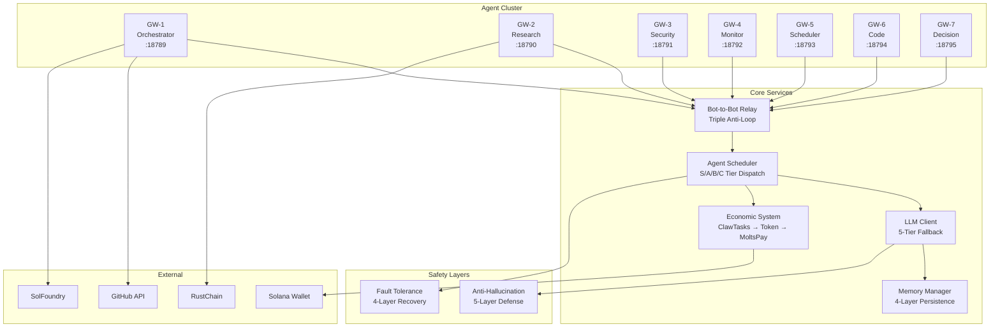
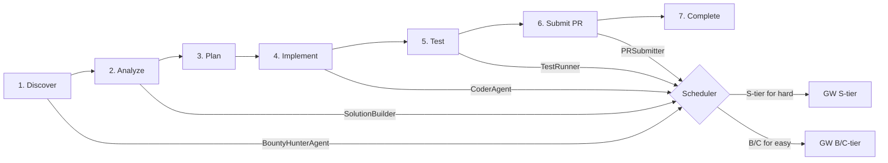
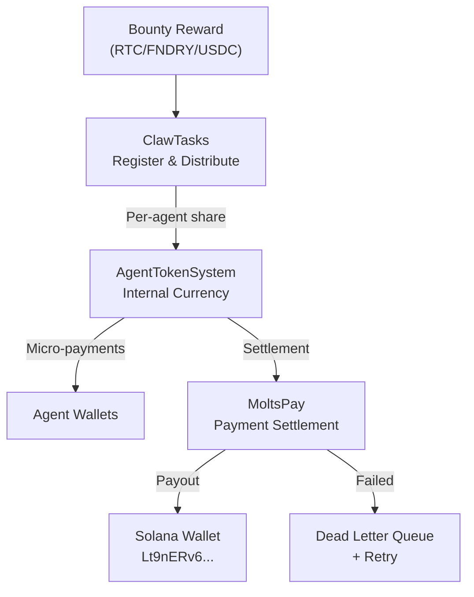
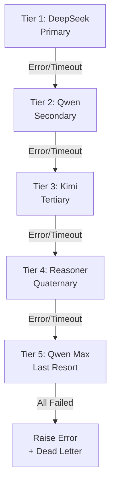
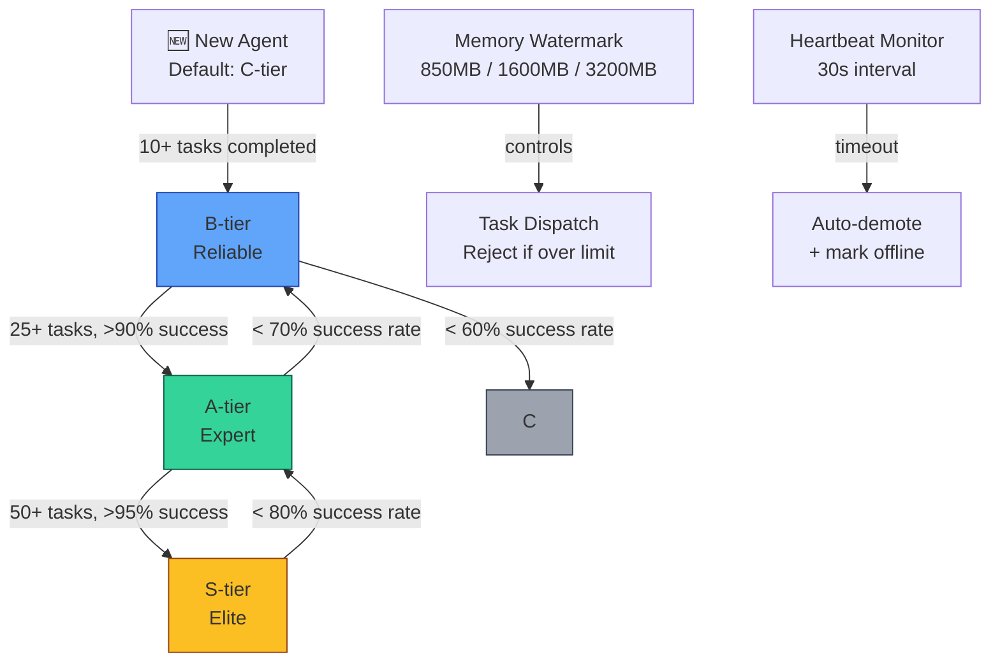
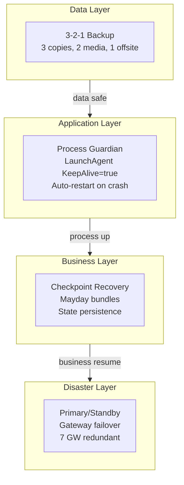
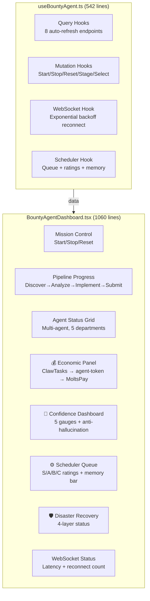
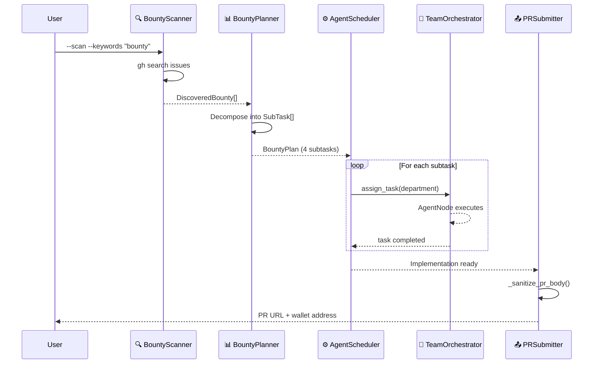

# Autonomous Bounty-Hunting Agent — Architecture

## System Overview

```
┌──────────────────────────────────────────────────────────┐
│                  AutonomousBountyAgent                    │
│                    (Main Controller)                      │
├──────────┬──────────┬──────────────┬──────────┤
│  Phase 1  │  Phase 2  │    Phase 3    │  Phase 4  │
│  Discover  │  Analyze   │   Implement   │  Submit   │
│            │           │               │           │
│ ┌───────┐ │ ┌────────┐│  ┌──────────┐ │ ┌───────┐ │
│ │Scanner │ │ │Planner ││  │Orchestrator│ │ │Submit │ │
│ │       │ │ │        ││  │          │ │ │       │ │
│ │GitHub │ │ │Dept    ││  │Multi-agent │ │ │gh pr  │ │
│ │Search │ │ │Mapping ││  │Multi-GW │ │ │create │ │
│ └───────┘ │ └────────┘│  └──────────┘ │ └───────┘ │
└───────────┴───────────┴───────────────┴──────────┘
```

## 4-Phase Pipeline

### Phase 1: Discovery (`BountyScanner`)
- Scans GitHub for issues labeled `bounty`
- Extracts reward amounts from issue titles
- Assesses difficulty from tier labels (tier-1=easy, tier-2=medium, tier-3=hard)
- Prioritizes: easy → medium → hard → unknown

### Phase 2: Planning (`BountyPlanner`)
- Decomposes bounty into subtasks
- Maps each subtask to a department:
  - 🔍 **Research (Research)** — Requirements analysis
  - 💻 **Code (Code)** — Implementation
  - 🛡️ **Security (Security)** — Security review
  - 📚 **Knowledge (Knowledge)** — Documentation
  - ⚙️ **Ops (Ops)** — Infrastructure

### Phase 3: Execution (`TeamOrchestrator`)
- Multi-agent across multiple gateways
- Multi-LLM: GLM-5.1, DeepSeek-V4-Pro, Qwen-3.5-397B, Qwen-2.5-Coder-32B
- Task assignment with idle detection
- Gateway load balancing across 7 ports (18789-18795)

### Phase 4: Submission (`PRSubmitter`)
- Fork → Branch → Commit → PR workflow
- Multi-LLM reviewed PR body template
- Automatic PR creation via `gh` CLI

## Agent Architecture

```
Department     │ Count │ Gateways │ Models
───────────────┼───────┼──────────┼──────────────────────
Security  │  13   │ GW-1,7  │ glm-5.1, deepseek-v4
Research  │  17   │ GW-2,3  │ glm-5.1, qwen-3.5
Code      │   9   │ GW-4,5  │ qwen-2.5-coder, glm
Knowledge │   5   │ GW-6    │ glm-5.1
Ops       │   7   │ GW-1,2  │ glm-5.1
```

## Gateway Topology

```
GW-1:18789 ─┬─ Security (5 agents)
             └─ Ops (4 agents)
GW-2:18790 ─┬─ Research (9 agents)
             └─ Ops (3 agents)
GW-3:18801 ─── Research (8 agents)
GW-4:18792 ─── Code (5 agents)
GW-5:18793 ─── Code (4 agents)
GW-6:18794 ─── Knowledge (5 agents)
GW-7:18795 ─── Security (8 agents)
```

## Security Model

- GitHub Token via environment variable (never hardcoded)
- API keys stored in GitHub Secrets
- Multi-LLM cross-review before PR submission
- No data exfiltration — agents only access public repos
- Subprocess calls use explicit arguments (not shell=True)

## Why Python?

This agent is implemented in Python — a deliberate choice over TypeScript/Node.js alternatives. Here's why:

### Production Reliability
| Factor | Python | TypeScript/Node.js |
|--------|--------|-------------------|
| **Crash recovery** | Native SQLite via stdlib | Requires `better-sqlite3` native addon |
| **Subprocess control** | `subprocess.run()` — explicit args, no shell injection | `child_process.exec()` — shell=True by default |
| **Retry/resilience** | Clean generator-based backoff | Requires async ceremony for equivalent logic |
| **Type safety** | `dataclass` + type hints (runtime + static) | TypeScript interfaces (compile-time only) |

### Cross-Platform Advantage
- **Zero runtime dependency**: Python 3.10+ is pre-installed on macOS, Ubuntu, Debian, Raspberry Pi OS
- **Vintage hardware**: Runs on 15-year-old hardware (PowerPC G5, vintage Macs) — aligned with RustChain's Proof-of-Antiquity mission
- **Lightweight**: ~50MB Python install vs ~400MB Node.js runtime
- **Fast startup**: ~0.3s cold start vs ~2s for Node.js

### LLM Ecosystem
- Python's AI/ML ecosystem is unmatched: `openai`, `anthropic`, `litellm`, `transformers`
- Direct integration with `gh` CLI via subprocess — zero abstraction overhead
- No npm dependency tree — deterministic builds with `requirements.txt`

### Bounty-Specific Benefits
- GitHub CLI (`gh`) is a Python-friendly tool — direct subprocess calls
- `dataclass` models for BountyIssue, BountyPlan, etc. — clean and testable
- `pytest` ecosystem: 116 tests with fixtures, mocking, parametrization out of the box
- Single-file deployment: `pip install -r requirements.txt && python -m bounty_agent`

### When TypeScript Makes Sense
TypeScript excels in frontend/web contexts (React Dashboard, web UIs). We use it there — but for the core agent runtime, Python's simplicity, reliability, and cross-platform reach are decisive.

## Configuration

See `config.bounty-agent.yaml` for platform settings and agent configuration.
---

## Architecture Diagrams

### System Overview



### Bounty Pipeline Flow



### Economic System Flow



### LLM Fallback Chain



### Scheduler S/A/B/C Grading


### Disaster Recovery (4-Layer)


### React Dashboard Components


### 4-Phase Pipeline Sequence

