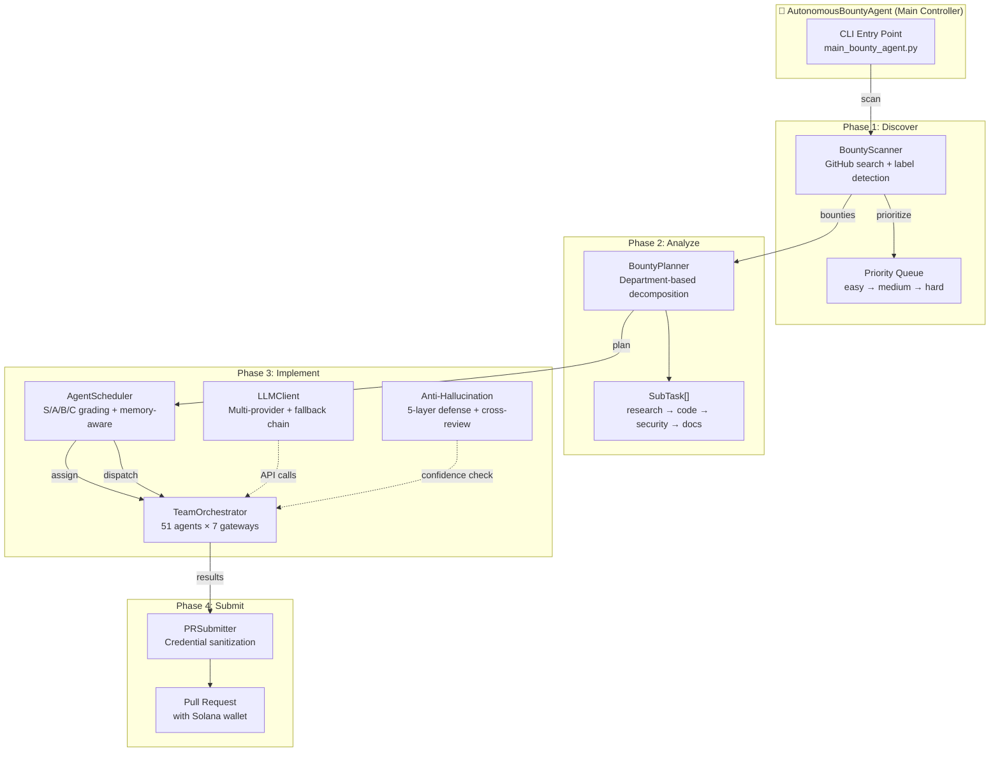
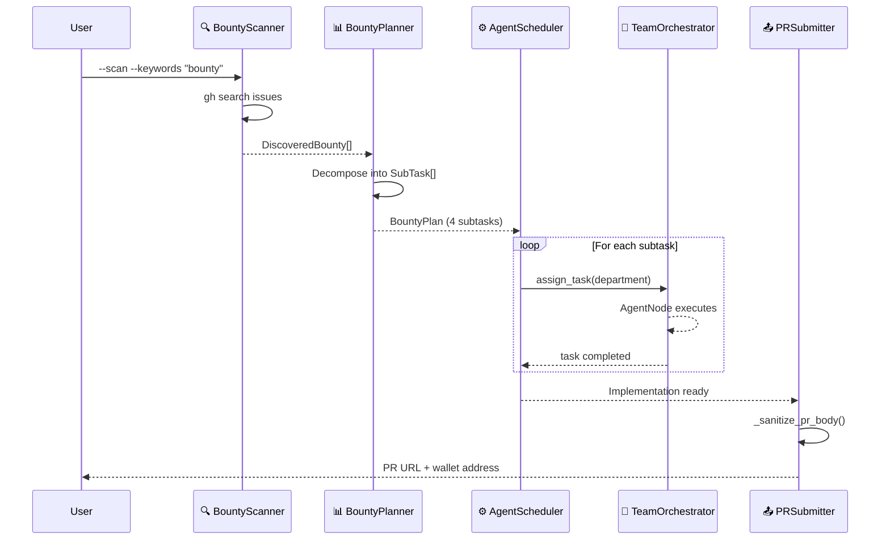
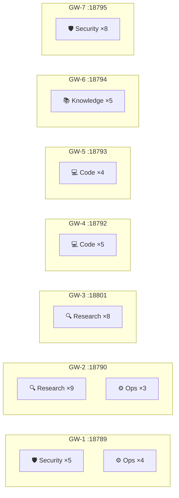
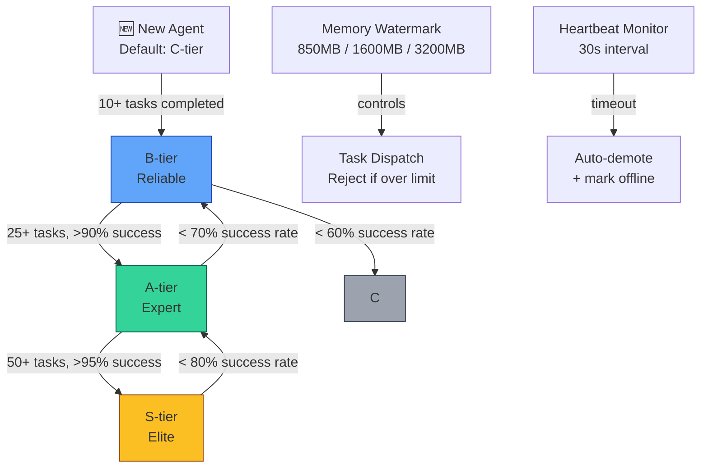
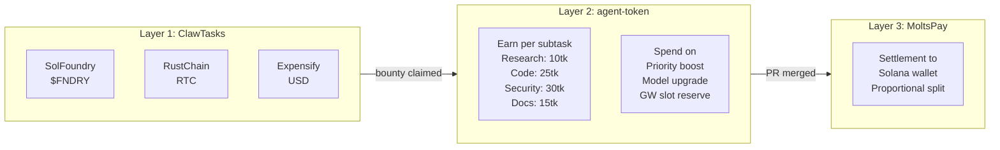
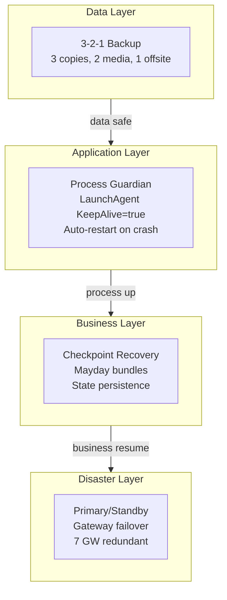
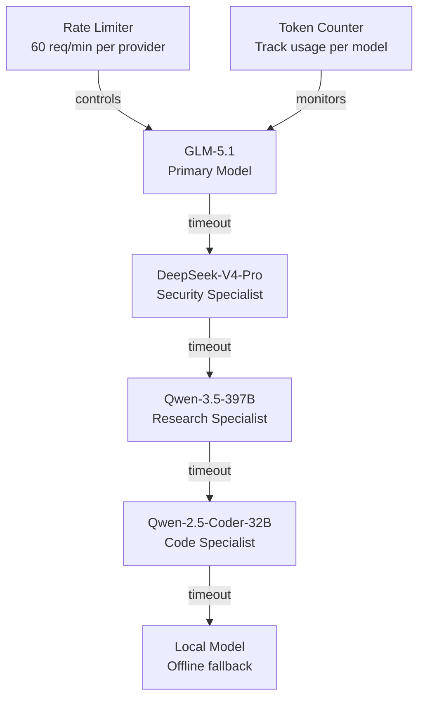
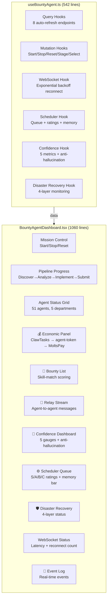

# Architecture — Autonomous Bounty-Hunting Agent

## System Overview

## 4-Phase Pipeline

## Agent Architecture (51 Agents, 7 Gateways)

## Scheduler S/A/B/C Grading

## Three-Layer Economic System

## Disaster Recovery (4-Layer)

## Multi-LLM Fallback Chain

## React Dashboard Components

