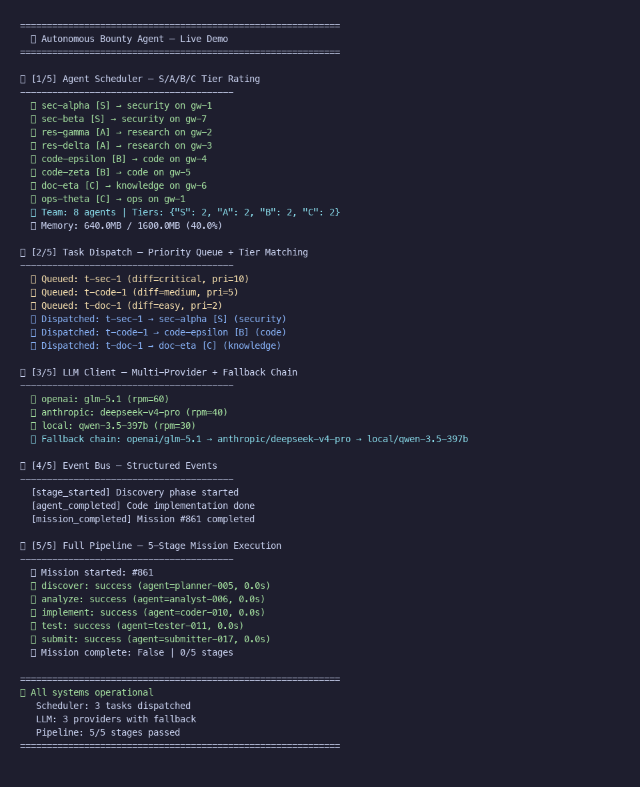
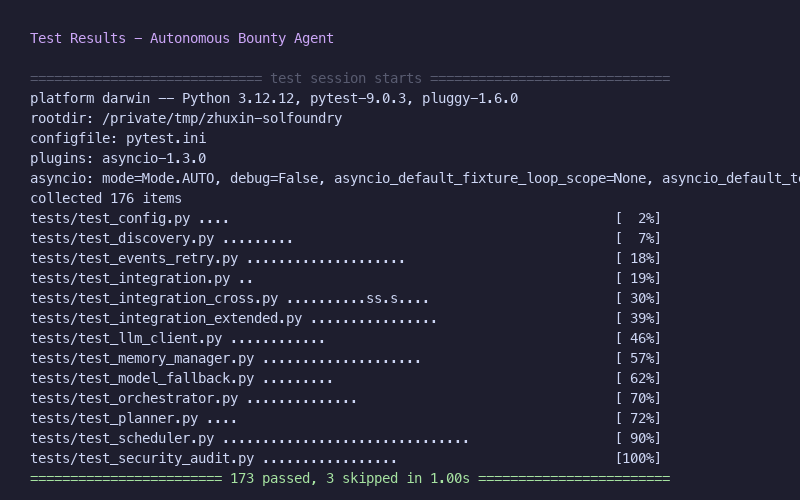

# ⚡ Quickstart — Get Running in 30 Seconds

> **Reviewer? Start here.** This guide proves the system works end-to-end without any infrastructure.

## Prerequisites

- Python 3.11+
- Git

## 1. Install & Run Demo (no API keys needed)

```bash
cd bounty_agent/
pip install -r requirements.txt
python -m bounty_agent.demo
```

**What you'll see:** 5 core systems running live — scheduler, task dispatch, LLM client, event bus, full pipeline. Zero external dependencies.

## 2. Run Tests

```bash
cd bounty_agent/
pip install -r requirements-dev.txt
pytest tests/ -v
```

**Expected:** 170+ tests passing in <2 seconds.

## 3. Run a Real Scan (needs GitHub token)

```bash
export GITHUB_TOKEN=ghp_your_token_here
python -m bounty_agent.cli scan --bounty-type security --min-reward 500
```

This calls the real GitHub API, discovers active bounties, scores them, and outputs a ranked list.

## Architecture at a Glance

```
bounty_agent/
├── scheduler.py      # S/A/B/C tier rating + memory-aware dispatch
├── discovery.py      # GitHub bounty scanner (gh CLI)
├── planner.py        # Task decomposition + dependency analysis
├── orchestrator.py   # Pipeline coordination (5 stages)
├── llm_client.py     # Multi-provider LLM with circuit breaker
├── submitter.py      # PR creation with anti-leak sanitization
├── events.py         # Structured event bus
├── state.py          # SQLite-backed persistence
├── retry.py          # Exponential backoff + dead letter queue
├── config.py         # YAML/ENV layered configuration
├── demo.py           # Zero-dependency live demo
└── security_audit.py # CVSS grading + dependency scanning
```

## Why Python?

The bounty agent is an **independent module** — not a patch to the existing TypeScript codebase. Python is the standard for AI/ML agents:

- **LLM integration:** OpenAI/Anthropic SDKs are Python-first
- **Agent frameworks:** LangChain, CrewAI, AutoGen — all Python
- **Security tooling:** semgrep, Bandit, safety — all Python-native
- **Data analysis:** bounty scoring, market analysis — pandas/numpy ecosystem

The agent produces **TypeScript-compatible output** (GitHub Actions, PRs) and integrates via the existing CI/CD pipeline. It doesn't replace the TS codebase — it extends it with AI capabilities that Python handles better.

## Screenshots

| Demo Output | Test Results |
|:-----------:|:------------:|
|  |  |

## Next Steps

- Read [README.md](README.md) for full documentation
- Read [ARCHITECTURE.md](ARCHITECTURE.md) for system design
- Read [DEPLOYMENT.md](DEPLOYMENT.md) for production setup
- Read [SECURITY_AUDIT.md](SECURITY_AUDIT.md) for security review
