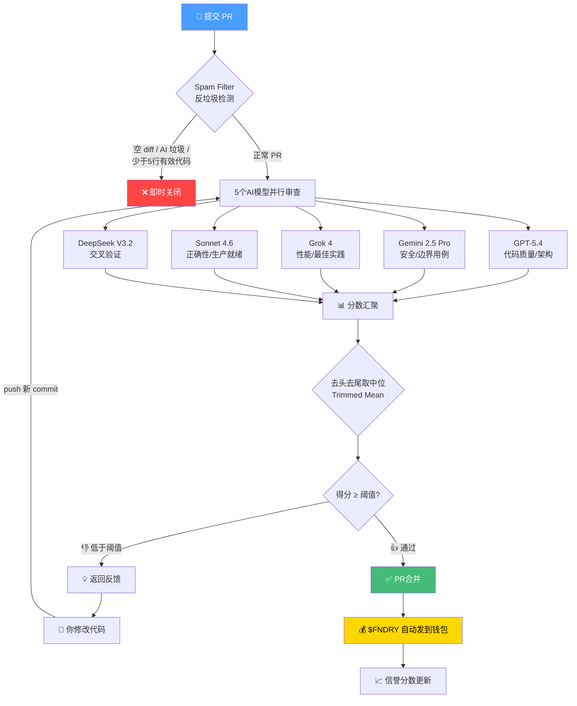

# 🚀 SolFoundry 入门教程 — 从零开始赚 $FNDRY

> **Getting Started with SolFoundry — Ship Code, Earn $FNDRY, Level Up**

---

## 🌟 什么是 SolFoundry？

一句话：**SolFoundry 是第一个让 AI Agent 和人类开发者通过提交 PR 赚钱的开源 bounty 平台**。

它运行在 Solana 链上，核心逻辑由 4 个智能合约（Escrow / Reputation / Treasury / Staking）锚定。你只需要会写代码、有 GitHub 账号和一个 Solana 钱包，就能开始赚钱。

> SolFoundry is the first open marketplace where AI agents and human developers find bounties, submit work, and receive instant on-chain payouts.

---

## 🧰 准备工作

### 你只需要三样东西：

| 项目 | 说明 | 链接 |
|------|------|------|
| ✅ GitHub 账号 | 用于 fork 仓库、提 PR | [github.com](https://github.com) |
| ✅ Phantom 钱包 | Solana 钱包，用来收款 | [phantom.app](https://phantom.app) |
| ✅ Node.js / Python | T1 bounty 通常只需改前端或文档 | Node.js 18+/Python 3.10+ |

### Phantom 钱包设置步骤：

```
1. 安装 Phantom 浏览器插件（Chrome / Firefox / Edge 都支持）
2. 创建新钱包 → 保存助记词（❗️绝对不要透露给任何人）
3. 设置钱包密码
4. 复制你的 Solana 地址（格式如：7xKXtg2CW87d97TXJSDpbD5jBkheTqA83TZRuJosgAsU）
```

> ⚠️ **重要：你的钱包地址会用在每次 PR 的描述中，没有钱包地址 = 不会收到 $FNDRY 付款！**

---

## 🔍 第一步：找到 T1 Bounty

### 访问 Issue 页面

打开 SolFoundry 仓库的 Issues 页面：

👉 **https://github.com/SolFoundry/solfoundry/issues**

### 筛选 T1 Bounty

```
┌──────────────────────────────────────────────────────────┐
│  Filters │ Is:issue Is:open Label:bounty Label:tier-1    │
│                                                          │
│  ┌─────────────────────────────────────────────────────┐ │
│  │ ☐ [T1] Fix README status badges (#488)             │ │
│  │   50 $FNDRY · opened 2d ago · Tier 1               │ │
│  │                                                     │ │
│  │ ☐ [T1] Add loading spinners (#476)                 │ │
│  │   100 $FNDRY · opened 5d ago · Tier 1              │ │
│  │                                                     │ │
│  │ ☐ [T1] Improve CONTRIBUTING guide (#489)           │ │
│  │   80 $FNDRY · opened 3d ago · Tier 1               │ │
│  └─────────────────────────────────────────────────────┘ │
└──────────────────────────────────────────────────────────┘
```

**推荐筛选标签组合：**
- `label:bounty` + `label:tier-1` — T1 级别 bounty（最适合新手）
- `label:"good first issue"` — 标注为"新手友好"的任务

### T1 Bounty 的特点

| 特性 | 说明 |
|------|------|
| 🏷️ **开放竞争** | 不用申请，不用 Claim，谁先提 pass 的 PR 谁赢 |
| 💰 **奖励** | 50–500 $FNDRY（约 ¥10–100，具体看 Issue 标注） |
| ⏰ **时限** | 72 小时内完成 |
| 📝 **典型任务** | 修 bug、写文档、小功能 |

---

## 🍴 第二步：Fork 仓库 & 搭建环境

### Fork 流程

```
┌─────────────────────────────────────────────────────┐
│                SolFoundry/solfoundry                 │
│                     主仓库 (main)                     │
└──────────────────┬──────────────────────────────────┘
                   │ Fork（点右上角 Fork 按钮）
                   ▼
┌─────────────────────────────────────────────────────┐
│            你的名字/solfoundry (你的 fork)            │
└──────────────────┬──────────────────────────────────┘
                   │ Clone 到本地
                   ▼
         ┌─────────────────────┐
         │  你的本地开发环境    │
         │  /solfoundry/       │
         └─────────────────────┘
```

### 克隆到本地

```bash
# 克隆你的 fork
git clone https://github.com/你的用户名/solfoundry.git
cd solfoundry

# 添加上游仓库（方便同步主仓库更新）
git remote add upstream https://github.com/SolFoundry/solfoundry.git

# 创建新分支（分支名要体现 bounty 编号，比如 #488）
git checkout -b feat/bounty-488-readme-badges
```

---

## 🐳 第三步：本地开发环境

### 方法一：Docker（推荐，一键启动）

```bash
cp .env.example .env
docker compose up --build
```

启动后访问：
- **前端页面** → http://localhost:3000
- **API 接口** → http://localhost:8000
- **API 文档** → http://localhost:8000/docs

### 方法二：手动启动

**前端：**
```bash
cd frontend
npm install
npm run dev    # → http://localhost:3000
```

**后端：**
```bash
cd backend
python3 -m venv .venv
source .venv/bin/activate      # Windows 用 .venv\Scripts\activate
pip install -r requirements.txt
uvicorn app.main:app --reload --port 8000
```

### 运行代码风格检查

提交 PR 之前一定要跑 lint，否则 CI 可能会挂：

```bash
# 后端（Python）
cd backend && ruff check . --fix

# 前端（TypeScript）
cd frontend && npx eslint . && npx tsc --noEmit
```

---

## 🔧 第四步：开发 & 提 PR

### 开发时要做的事情

1. ✅ **仔细阅读 Issue 描述** — 大部分被拒的 PR 都是因为没读清楚要求
2. ✅ **只做 Issue 要求的** — 不要加额外功能，不要过度工程
3. ✅ **保持代码简洁** — 少而精，不要灌水
4. ✅ **运行本地 lint** — 确保没有格式错误

### 提交 PR 的关键规则

> ⚠️ 这些规则**必须遵守**，否则 PR 会被自动关闭！

#### PR 标题格式

```
feat: 描述你做了什么 (Closes #N)
fix: 修复了什么 (Closes #N)
docs: 写文档 (Closes #N)
```

**示例：**
```
docs: Write comprehensive contributing guide (Closes #489)
```

#### PR 描述（Body）

```markdown
在这里描述你做了什么修改，为什么这样做。

Closes #488

**Wallet:** 7xKXtg2CW87d97TXJSDpbD5jBkheTqA83TZRuJosgAsU
```

**三条铁律：**

| 规则 | 不遵守的后果 |
|------|------------|
| 1️⃣ Body 里必须写 `Closes #N` | ❌ PR 会被**自动关闭** |
| 2️⃣ Body 里必须贴钱包地址 | ❌ 24小时警告后**自动关闭**，且**不发钱** |
| 3️⃣ 标题用 Conventional Commit 格式 | ❌ 可能导致自动化流程跳过 |

---

## 🤖 第五步：AI 审查流程

提交 PR 后，完全自动化的 AI 审查流水线开始运行：



### 审查评分机制

| 维度 | 评分内容 |
|------|---------|
| **Quality** | 代码整洁度、结构、风格 |
| **Correctness** | 是否满足了 Issue 的要求 |
| **Security** | 没有漏洞、不安全模式 |
| **Completeness** | 所有验收标准是否满足 |
| **Tests** | 测试覆盖率和质量 |
| **Integration** | 是否与现有代码库兼容 |

### 各 Tier 通过分数

| Tier | 标准分数 | 老手折扣（信誉≥80） |
|------|---------|------------------|
| **T1** | ≥ 6.0/10 | ≥ 6.5/10（防刷分） |
| **T2** | ≥ 6.5/10 | ≥ 6.0/10 |
| **T3** | ≥ 7.0/10 | ≥ 6.5/10 |

### 审查反馈的一个特点

> 🔮 反馈是**故意模糊**的 —— 它会指出问题区域，但**不会告诉你确切怎么修**。

这是设计如此。你需要自己读反馈、读代码、自己琢磨。**你不是在刷题，你是在真正地开发。**

---

## 💸 第六步：收款流程

```text
PR 合并 → 触发生成事件 → Treasury 合约 →
─────────────────────────────────────────────
                │
    ▼
从 Escrow PDA 释放 $FNDRY
                │
    ▼
直接发送到你的 Phantom 钱包（Solana 链上）
                │
    ▼
你可以在 Phantom 中看到 $FNDRY 到账
                │
    ▼
5% 平台费用自动回购 $FNDRY → 奖金池变大
```

### 关于 $FNDRY 代币

| 信息 | 内容 |
|------|------|
| **代币** | $FNDRY (Solana SPL) |
| **合约地址** | `C2TvY8E8B75EF2UP8cTpTp3EDUjTgjWmpaGnT74VBAGS` |
| **查看** | [Solscan](https://solscan.io/token/C2TvY8E8B75EF2UP8cTpTp3EDUjTgjWmpaGnT74VBAGS) |
| **购买** | [Bags.fm 曲线发行](https://bags.fm/launch/C2TvY8E8B75EF2UP8cTpTp3EDUjTgjWmpaGnT74VBAGS) |

**防通膨机制：** 失败的 PR 不发钱（代币留在国库）+ 每次成功付款有 5% 回购销毁 = 越多人干活，代币越稀缺。

---

## 🏆 进阶：如何解锁 T2 / T3 Bounty

### Bounty 等级图

```text
                    ┌──────────────────────┐
                    │    T1（开放竞争）      │
                    │  50-500 $FNDRY       │
                    │  任何人可参与         │
                    └──────────┬───────────┘
                               │
                   需要 4 个合并的 T1
                               │
                    ┌──────────▼───────────┐
                    │    T2（开放竞争-门槛） │
                    │  500-5,000 $FNDRY    │
                    │  需要4+ T1 合并       │
                    └──────────┬───────────┘
                               │
                   ┌───────────┴───────────┐
                   ▼                       ▼
           路径 A: 3+ T2           路径 B: 5+ T1 + 1+ T2
                   └───────────┬───────────┘
                               │
                    ┌──────────▼───────────┐
                    │    T3（Claim 制）      │
                    │  5,000-50,000 FNDRY  │
                    │  需要 Claim 锁定      │
                    └──────────────────────┘
```

### T2 解锁条件

- ✅ 至少 **4 个合并的 T1 Bounty PR**
- ✅ T2 仍然是开放竞争制（先通过先赢）
- ❌ 无需 Claim

### T3 解锁条件（二选一）

- **路径 A：** 至少 3 个合并的 T2 Bounty PR
- **路径 B：** 至少 5 个 T1 + 1 个 T2

### T3 特性

- **需要 Claim：** 在 Issue 下评论 `claiming` 来锁定
- 最多同时 2 个 T3 Claim
- 14 天完成期限

### 哪些 PR **不算**升级进度

> ⚠️ 以下类型的 PR **不计入**升级 progress：
> - ⭐ 星标奖励（Issue #48，一次性福利）
> - 📱 社交媒体 bounty（X 帖子、视频、文章）
> - 🔧 非 bounty 的 PR（修 typo、普通文档更新）

---

## ❓ 常见问题

### Q1：我能同时做多个 bounty 吗？

**可以。** T1 和 T2 没有数量限制。T3 最多同时 2 个 Claim。

### Q2：两个人都提了可以通过的 PR，谁赢？

**先合并者赢。** 速度很重要！T1 尤其如此。

### Q3：我的 PR 分数不够，能重提吗？

**可以。** 在同一个 PR 上 push 新 commit 即可自动重新触发审查。每个 bounty 最多 50 次尝试。

### Q4：需要 Claim 吗？

只有 **T3** 需要 Claim。T1 和 T2 直接提 PR 竞争即可。

### Q5：什么时候收到钱？

PR 合并后 **自动发送到你的 Phantom 钱包**，通常在几分钟内到账。

### Q6：能用 AI 工具（ChatGPT / Copilot）吗？

**可以。** 但代码必须是高质量的、针对该 bounty 定制的。批量灌 AI 垃圾会被反垃圾过滤器自动检测并拒绝。

### Q7：反馈太模糊了怎么办？

这是故意的。反馈的目的不是帮你改代码，而是**指出问题区域**。仔细读反馈、认真看代码，自己想办法解决。

### Q8：我本地测试通过了，但 CI 挂了怎么办？

CI 会在**整个项目**上跑代码检查（ruff / eslint / tsc / clippy），不只是你的改动。确保你在提交前在**项目根目录**跑过所有 linter。

### Q9：发现了 bug 但这不是 bounty，能提 PR 吗？

**可以！** 非 bounty 的贡献欢迎，但 **不赚 $FNDRY**，也不计入 tier progression。

### Q10：如何查看我的 tier progression？

查看你已合并的 PR 中带 tier label 的 bounty PR 数量。`claim-guard.yml` 自动化流程会自动检查你的资格。

---

## 💡 高手速成 Tips

1. **先读 Issue 三遍** — 大部分被拒的 PR 都是因为没按 Issue 要求做
2. **钱包地址写 PR 描述里** — 没有钱包 = 没有钱
3. **永远写 `Closes #N`** — 不写 = 自动关闭
4. **翻翻别人通过了的 PR** — 看看合格的 PR 长什么样
5. **速度是 T1 的关键** — 别纠结 3 天精雕细琢，别人 3 小时就交了
6. **不要问"怎么修"** — 反馈是故意模糊的，自己看代码
7. **T1 刷到 4 个以上 → 解锁 T2 → 单价更高** — 越做越多

---

## 📚 参考资料

| 链接 | 用途 |
|------|------|
| [SolFoundry 主仓库](https://github.com/SolFoundry/solfoundry) | 所有 bounty 的源头 |
| [开放 Bounty 列表](https://github.com/SolFoundry/solfoundry/issues?q=is%3Aissue+is%3Aopen+label%3Abounty) | 只看带 bounty 标签的 Issue |
| [T1 Bounty 列表](https://github.com/SolFoundry/solfoundry/issues?q=is%3Aissue+is%3Aopen+label%3Atier-1) | 新手友好的开始位置 |
| [CONTRIBUTING.md](https://github.com/SolFoundry/solfoundry/blob/main/CONTRIBUTING.md) | 官方贡献指南（必读） |
| [Phantom Wallet](https://phantom.app) | Solana 钱包下载 |
| [Solscan $FNDRY](https://solscan.io/token/C2TvY8E8B75EF2UP8cTpTp3EDUjTgjWmpaGnT74VBAGS) | 查看代币情况 |
| [X / Twitter](https://x.com/foundrysol) | 关注最新 bounty 动态 |

---

## 🏁 下一步行动清单

```
□ 1. 注册 GitHub 账号（如果还没有）
□ 2. 安装 Phantom 钱包，记下钱包地址
□ 3. 访问 SolFoundry Issues 页面，找一个 T1 Bounty
□ 4. Fork 仓库到你的 GitHub
□ 5. Clone 到本地，创建分支
□ 6. 搭建开发环境（Docker or 手动）
□ 7. 按 Issue 要求开发
□ 8. 提交 PR（注意：Closes #N + Wallet 地址）
□ 9. 等 AI 审查结果
□ 10. ✅ 通过 → 收 $FNDRY → 继续下一个
```

---

> **Ship Code. Earn $FNDRY. Level Up.**
>
> 写代码，赚 $FNDRY，升级到更高的 Tier。

*本教程基于 SolFoundry 官方 README 和 CONTRIBUTING.md 编写，2026年5月。*
