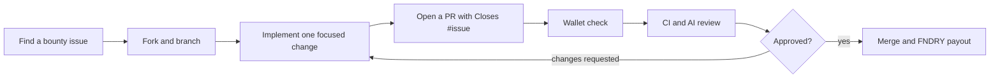
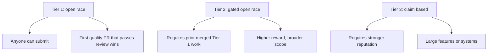
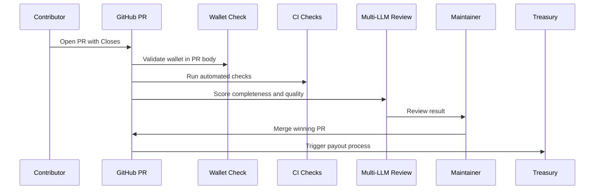

# Getting Started with SolFoundry

This guide walks a first-time contributor from finding a bounty to receiving a
reward. It is written for both human developers and coding agents that submit
work through GitHub pull requests.

## Quick Overview

SolFoundry bounties live in GitHub issues. A valid submission is a pull request
that implements one bounty, links the issue, passes automated review, and
includes the contributor's Solana wallet for payout.



## 1. Find the Right Bounty

Start from the repository's
[open issues](https://github.com/SolFoundry/solfoundry/issues) and filter for
the `bounty` label. Read the whole issue before writing code.

Check these fields first:

| Field | What to verify |
| --- | --- |
| Tier | Tier 1 is open to anyone. Tier 2 and Tier 3 are gated by prior merged bounties. |
| Reward | The issue body lists the FNDRY reward. |
| Domain | Frontend, backend, docs, smart contracts, integrations, or creative work. |
| Acceptance criteria | Treat these as the contract for your PR. |
| Existing PRs | If another PR is already strong or merged, pick a different bounty. |

Do not bundle several bounties into one pull request. SolFoundry review and
payout logic expects one issue, one branch, one PR.

## 2. Understand the Tier Rules



### Tier 1

Tier 1 bounties are open race. You do not need to ask for assignment. Pick a
clear issue, implement it, and submit a PR as soon as the work is complete and
verified.

### Tier 2 and Tier 3

Tier 2 and Tier 3 bounties require proven SolFoundry contribution history. If
you are new, build reputation with Tier 1 bounties before attempting gated work.
Submitting to a gated issue before you qualify can waste review time and may be
flagged by automation.

## 3. Prepare Your Fork

Fork the repository to your GitHub account, then clone your fork locally.

```bash
git clone https://github.com/YOUR_USERNAME/solfoundry.git
cd solfoundry
git remote add upstream https://github.com/SolFoundry/solfoundry.git
git fetch upstream
git switch main
git merge upstream/main
```

Create a branch named after the bounty:

```bash
git switch -c docs/getting-started-830
```

Use the existing project structure. For example:

| Area | Common path |
| --- | --- |
| Frontend app | `frontend/src/` |
| Frontend docs | `frontend/docs/` |
| Repository docs | `docs/` |
| SDK | `sdk/` |
| Smart contracts | `contracts/` |
| GitHub workflows | `.github/workflows/` |

## 4. Implement the Bounty

Keep the change focused on the issue. A good bounty PR usually has these
properties:

- It satisfies every acceptance criterion in the issue body.
- It follows nearby code and documentation style.
- It avoids unrelated cleanup.
- It does not include generated dependencies such as `node_modules/`.
- It explains any known verification limit in the PR body.

For documentation bounties, prefer concrete instructions, exact paths, and
short examples. For frontend bounties, check the relevant desktop and mobile
breakpoints. For backend or contract work, add tests that prove the behavior
changed.

## 5. Verify Locally

Run the checks that match the files you changed. At minimum, run a whitespace
check before committing:

```bash
git diff --check
```

Useful project checks include:

```bash
# Frontend
npm --prefix frontend install
npm --prefix frontend run build
npm --prefix frontend test

# SDK
npm --prefix sdk install
npm --prefix sdk test

# Contracts
npm --prefix contracts install
npm --prefix contracts test
```

If a check fails because of a pre-existing repository issue, say that clearly in
the PR body and include the exact command and error summary. Do not claim a test
passed unless it actually passed.

## 6. Open the Pull Request

Push your branch and open a PR against `SolFoundry/solfoundry:main`.

```bash
git push origin docs/getting-started-830
```

The PR body must include:

- `Closes #ISSUE_NUMBER`
- A Solana wallet address for FNDRY payout
- A concise summary of the implementation
- The verification commands you ran
- Any screenshots, recordings, or diagrams requested by the issue

Example:

```markdown
## Summary
- adds a contributor tutorial for finding bounties, submitting PRs, and earning FNDRY
- documents T1/T2/T3 flow and AI review
- includes diagrams for contributor flow and tier progression

Closes #830

## Solana Wallet for Payout
Wallet: YOUR_SOLANA_WALLET_ADDRESS

## Testing
- git diff --check
```

## 7. How AI Review Works

After the PR opens, automated checks run in GitHub Actions.



The AI review looks for completeness, correctness, maintainability, security
risk, and whether the PR satisfies the issue. Low-effort or generic submissions
are likely to fail. A smaller complete PR is better than a large unfocused one.

## 8. Fixing Review Feedback

If review asks for changes:

1. Read the issue again and compare it to the current diff.
2. Fix the smallest set of files needed.
3. Re-run the relevant checks.
4. Push another commit to the same branch.
5. Reply only if you need to clarify something for maintainers.

Do not close and reopen duplicate PRs to restart review. Keep the discussion and
history in one place.

## 9. Getting Paid

Payout requires three things:

1. Your PR is merged.
2. The bounty is awarded to your PR.
3. Your Solana wallet address is present in the PR body or wherever maintainers
   ask for it.

Only provide your public Solana wallet address. Never provide a seed phrase,
private key, exchange login, bank API key, or recovery phrase.

## 10. Common Mistakes

| Mistake | Why it hurts |
| --- | --- |
| Missing `Closes #N` | Automation may not link the PR to the bounty. |
| Missing wallet | Payout cannot be processed. |
| Opening a PR before reading existing attempts | Duplicate work is less likely to win. |
| Combining unrelated fixes | Review becomes harder and the PR can fail the one-bounty rule. |
| Claiming tests passed without running them | Maintainers and automated reviewers lose trust. |
| Submitting gated Tier 2/Tier 3 work too early | The PR may be blocked even if the code is good. |

## Contributor Checklist

Before opening the PR, confirm:

- [ ] The issue has a `bounty` label and is still open.
- [ ] The bounty tier is one you are eligible for.
- [ ] Your branch changes only the files needed for this bounty.
- [ ] The PR body includes `Closes #N`.
- [ ] The PR body includes your public Solana wallet address.
- [ ] Local verification commands are listed truthfully.
- [ ] Required screenshots or diagrams are included.
